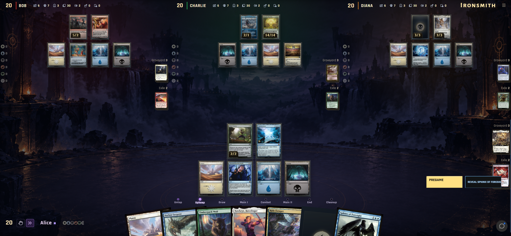
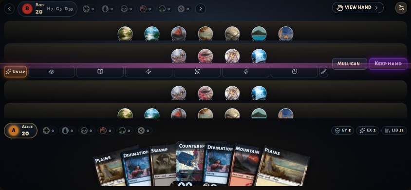

<div align="center">

# Ironsmith

**Magic: The Gathering, powered by a browser-native rules engine.**

Compile cards from Oracle text. Explore interactions. Play with up to four players.

**[Play the fork](https://fiammamuscari.github.io/ironsmith/)** ·
[Getting started](#getting-started) ·
[Run locally](#running-ironsmith-locally) ·
[Deployment status](https://github.com/FiammaMuscari/ironsmith/actions/workflows/deploy-ui-pages.yml)

[](https://fiammamuscari.github.io/ironsmith/)

<sub>Desktop interface preview from the fork's playtests. Open the game to see the latest deployed UI.</sub>

</div>

## At a glance

- **Play and experiment:** random boards, imported decks, and shareable puzzle positions.
- **Read the table:** battlefield grids, zone icons, counters, and compact gameplay controls.
- **Create cards:** compile plain rules English into playable definitions.
- **Stay in the browser:** a Rust/WebAssembly engine drives the game without a game server.

<details>
<summary><strong>Mobile interface preview</strong></summary>



Development preview of the landscape layout. Controls may differ in the latest build.

</details>

### About this fork

This repository is FiammaMuscari's fork of
[Chiplis/ironsmith](https://github.com/Chiplis/ironsmith). It follows the
upstream rules engine and adds interface work for the battlefield, card
counters, zone icons, and compact gameplay controls. Credit for the original
project belongs to Chiplis and its contributors.

- [Original hosted version](https://chiplis.com/ironsmith)
- [Fork source](https://github.com/FiammaMuscari/ironsmith)
- [Build and deployment status](https://github.com/FiammaMuscari/ironsmith/actions/workflows/deploy-ui-pages.yml)

The hosted fork reflects the latest **successful deployment**, not necessarily
every local experiment or commit. The guide below describes the shared game
features; control placement can differ between the fork and upstream.

<details>
<summary><strong>Under the hood: rules engine and verified multiplayer</strong></summary>

### How it works

- **Cards come from their text, not from hand-written scripts.** A compiler
  written in Rust reads each card's Oracle wording the way a player would:
  lexing, then grammar, then resolving what "it" and "that creature" refer to,
  and finally producing a runtime card definition. More than 28,000 cards
  compile today. The same compiler runs in the browser, so you can write a
  custom card in plain rules English and play it immediately.
- **The rules engine is deterministic.** It covers the stack, priority, combat,
  costs, triggers, replacement effects, and the layer and dependency system for
  continuous effects (CR 613). Given the same starting state and the same
  actions, it always reaches the same result.
- **Everything ships as WebAssembly.** The engine, the card compiler, and the
  cryptographic verifier are three WASM modules behind one JavaScript API. A
  compressed, indexed catalogue of every supported card is bundled with the
  engine, and a React interface drives it.

### Multiplayer without a trusted server

Online card games usually trust a central server to shuffle, hide your
opponents' hands, and enforce the rules. Ironsmith has no such server. In
**Verified** mode it replaces the server with cryptography:

- **Every player's browser runs the full rules engine** and checks every action
  everyone takes.
- **Decks are shuffled with *mental poker*,** a way of shuffling cards that
  nobody can see or control.
- **Every shuffle and every card reveal carries a zero-knowledge proof (ZKP),**
  so any peer can confirm it was done honestly without learning anything
  secret.

The protocol is designed so that a modified client can't draw a card it
didn't draw, stack its deck, peek at your hand, or get an illegal play
accepted: honest browsers reject the attempt, and the signed evidence can be
replayed by anyone. It hasn't had an independent security review yet, so treat
it as strong protection for casual and community play rather than a proven
guarantee (see [Honest limits](#honest-limits)). The full explanation is in
[Verified mode and tournaments](#verified-mode-and-tournaments-an-introduction-to-zero-knowledge-play).

</details>

---

## Contents

- [Getting started](#getting-started)
- [The table](#the-table)
- [Playing a game](#playing-a-game)
- [Loading decks](#loading-decks)
- [Custom cards and board setup](#custom-cards-and-board-setup)
- [Multiplayer](#multiplayer)
- [Verified mode and tournaments: an introduction to zero-knowledge play](#verified-mode-and-tournaments-an-introduction-to-zero-knowledge-play)
- [Settings](#settings)
- [Mobile](#mobile)
- [Keyboard reference](#keyboard-reference)
- [Running Ironsmith locally](#running-ironsmith-locally)
- [Project layout](#project-layout)

---

## Getting started

1. Open <https://fiammamuscari.github.io/ironsmith/>. A progress bar appears while the
   engine downloads and loads the card catalogue.
2. You start at a table with a **randomly generated 1v1 board**:
   Alice and Bob each use a supported Modern deck from the lobby catalog.
   Cards from those decks form a position already in progress, with the
   remaining cards in each library (see [Random Game](#random-game)).
   There is no main menu, so you can start playing right away.
3. From here you can:
   - **Play the board as it is.** Use **Playing as** in the player header or
     turn status to switch seats. You control that seat; the other seat
     automatically passes priority and answers required decisions. You can
     switch sides to test interactions, goldfish, or play hotseat.
   - **Load real decks** with **Load Decks**, then **Test in game**.
   - **Roll a new random board** with **Random Game**.
   - **Build an exact position** with **Puzzle Setup** and share it as a link.
   - **Play people online** with **Create Lobby** (see
     [Multiplayer](#multiplayer)).

Open **Menu** beside your player information to find **Table actions**,
including deck loading, random games, puzzles, sharing, and lobbies. The
desktop player header also has quick **Add** and **Compile** controls.

## The table

| Area | What it shows |
|---|---|
| **Turn controls** | On desktop, the phase track and current action sit between the battlefields. The status shows the turn, active player, and priority holder, or the player currently making a decision. Compact layouts move these controls into a smaller toolbar. |
| **Opponents** (top) | Each opponent's battlefield, life total, and zone piles. |
| **You** (bottom) | Your battlefield, hand, life total, and mana pool. |
| **Player header** | **Playing as** switches seats in local games. The header also provides **Menu**, chat, and card setup shortcuts on desktop. |
| **Zone piles** | **GY** (graveyard), **Exile**, **CZ** (command zone) and **Library**. Click a pile to open it. When a pile holds legal targets it grows and highlights. |
| **Stack rail** | Beside the zone piles on desktop, it shows spells and abilities waiting to resolve, newest on top. It also previews pending triggers. Select an entry to inspect it and its targets. |
| **Inspector** | Hover over or click a card to see its rules text, counters, attachments, and activated abilities. The detail panel adapts to the available space; mobile uses a sheet. Hover a keyword or mana symbol for its rules explanation. Cards use the translated printing when one exists. |
| **Game Log** | Open **Menu → Turn controls → Open Log**. Lists every event, with **Show system events** for engine-level detail. |

## Playing a game

### Priority and the main button

The **main action strip** holds the action that moves the game forward.
On desktop it is docked with the turn controls between the battlefields;
mobile places it beside your player controls. Required choices expand into
decision panels with the relevant cards or options.

- The main button passes priority, and its label says where the game goes next:
  **Main I**, **Attackers**, **Blockers**, **Damage**, **Main II**,
  **Next Turn**, or **Resolve** when something is on the stack. When several
  objects are on the stack, **Resolve all** also appears.
- **Enter** presses the main button whenever there is only one choice.
- **?** (Explain current phase) describes the current step and your options
  in it.
- **Hold priority** keeps priority after you cast something, so you can respond
  to your own spell.
- **Auto-pass**, beside the turn controls, automatically presses **Resolve** whenever
  you have priority with something on the stack. It stays enabled until you turn
  it off and pauses for choices made during resolution.
- At the start of a game, choose **Keep hand** or **Mulligan**.

### Auto-pass

Use **Auto-pass** at the table, or **Auto-pass priority** under **Menu →
Turn controls**, to automatically pass your priority while the stack is not
empty. It pauses for your targeting, payment, and resolution choices.

In local games, the other seats automatically answer their own required
decisions: object and target selections, modes and ordering, counter
allocations, numbers, names, mana payments, and combat declarations. The
engine checks constrained selections, including linked targets, partial
completion, and mandatory attacks or blocks. This keeps effects moving while
leaving your choices for you to make. Automatic responses are for local play;
online opponents make their own decisions.

### Casting spells and activating abilities

- **Drag** a playable card from your hand onto the battlefield, or directly
  onto its target.
- **Click** a hand card to select it and pin it in the inspector, then press
  **Enter** or **Space** to play it.
  - If the card can be played more than one way (alternative costs, modal
    faces, adventures, and so on), a **Ways to play** picker opens.
  - A permanent you play with the keyboard stays attached to your pointer until
    you click where it goes. **Esc** puts it back in your hand.
- **Activated abilities** are buttons in the inspector. A greyed-out button
  tells you why the ability can't be activated right now.

### Targeting

Legal targets are highlighted and an arrow follows your pointer. Click a card
or a player to target it. Then use **Submit Targets**, **Next requirement**
when a spell has several kinds of targets, or **Skip** for optional targets.

### Paying mana

The **Pay Mana** panel suggests a payment plan and shows your mana pool before
and after paying. You can adjust the plan:

- Mark any source as **Require**, **Exclude**, or **Prefer to preserve**.
- Choose **Life first** for Phyrexian mana.
- Use **Replan** to recompute, or just click highlighted lands to tap them
  yourself.
- If you tap the wrong land, **Undo tap** reverses it.

### Combat

- **Attacking:** select a creature and then the player or planeswalker it
  attacks, or drag from one to the other. Finish with **Confirm Attackers**, or
  choose **Declare no attackers**.
- **Blocking:** select a blocker and then the attacker it blocks.

### Effect decisions

When a spell or ability needs a choice, its decision panel shows the legal
objects, modes, or input fields. You can select relevant cards directly on
the table or from an opened zone pile. Selection counts show the required
range; counter allocations use an amount for each counter type. Number and
card-name choices provide their own input fields.
Submit the choice to continue resolving the effect.

### Ordering choices

When several of your triggers happen at once, **Order In Stack** lets you
arrange them with arrows on the stack cards. When several replacement effects
apply to one event, you pick the order with **Apply First**.

## Loading decks

Choose **Menu → Table actions → Load Decks**. The catalog and player deck
editor share one screen, with **Load Decks → Configure → Start** showing the
workflow.

- **Players / deck assignment:** select the seat to edit, then paste a list or
  use a catalog deck. The editor offers ×1, ×2, and, when four seats are
  available, ×4. Editing one deck still starts a two-player local test;
  unassigned seats retain their existing decks.
- **Paste a list** in MTGO or Arena format:

  ```text
  4 Lightning Bolt
  4x Ragavan, Nimble Pilferer
  1 Urza's Saga (MH2) 259

  Commander
  1 Atraxa, Grand Unifier
  ```

  - Section headers `Deck`, `Commander`, `Sideboard`, `Companion` and
    `Maybeboard` are recognised.
  - Lines starting with `//` or `#` are ignored.
  - Set codes and collector numbers are optional. When present, they choose
    which printing is shown.
- **Browse decks:** competitive decklists for Standard, Pioneer, Modern,
  Legacy, Vintage, Pauper, and Commander.
  - Featured decks highlight recent major events.
  - Search by deck name, archetype, card, or event.
  - Filter by colour, using "Includes" or "Only these".
  - Sort by most recent, best placement, or most played.
  - Open a collection: **Last major events**, **Last 20 events**,
    **Mono-color**, or **My decks**.
  - **Use** loads a deck into the selected seat. **Copy MTGO** copies it as
    text. The editor shows main-deck and sideboard counts, with **Copy** and
    **Clear** controls for each seat.
- **Save configuration** stores a named set of decks for this browser
  session.

When the decks are ready:

- **Test in game** loads the decks into a local test position with cards
  already in play. It can load supported cards from a partially supported
  list and reports the omissions.
- **Lobby and share** opens a multiplayer lobby with these decks already
  assigned.

If any cards fail to load, a **Deck load issues** report lists them, and you
can copy the list.

## Custom cards and board setup

### Compile Card: write your own card

**Compile Card** opens the card forge.

1. Fill in a name, mana cost (for example `{2}{W}{U}`), types, rules text, and
   power/toughness, loyalty, or defense. Single, double-faced, and split
   layouts (with fuse) are supported.
2. Write the rules text the way a printed card would read it, for example
   *"Flying. Whenever this creature deals combat damage to a player, draw a
   card."*
3. The **Compile Status** panel recompiles as you type. It shows the card's
   **Compiled Text** (the compiler's understanding of your card, turned back
   into English) and its **Compiled Abilities**, or explains what it couldn't
   parse.
4. Choose a player and a zone, then click **Compile**. The card enters the
   game.

To get started quickly, the forge fills itself in with a random card from your
deck (**New Sample** picks another).

### Add Card

**Add Card** puts any supported card into any player's hand, battlefield,
graveyard, exile, library, or command zone. Tick **Skip triggers** to add it
without firing its enters-the-battlefield abilities. This is the fastest way to
set up a board for testing an interaction.

### Puzzle Setup and Share Table

- **Puzzle Setup** (*Share A Board Position*) builds an exact game state: each
  player's name, life total, and the cards in each zone, one card per line.
  - **Import Current Table** copies what is on the board now.
  - **Copy Link** produces a URL. Anyone who opens it loads the same position.
  - Your unfinished draft is saved in the browser.
- **Share Table** copies a link to the current board in one click.

### Random Game

**Random Game** creates a **1v1 position from two complete lobby catalog
decks**. Choose **Format**, **Starting life**, and an optional **Seed**, then
click **Generate**. Modern and 20 life are the defaults; choosing Commander
sets 40 life while keeping the random game 1v1.

Only decks whose entire main deck and commanders are supported and meet the
**Card fidelity threshold** in Table Settings are eligible. Each position
moves existing card copies into the battlefield, hand, and graveyard; all
remaining main-deck cards stay in the library, and commanders go in the
command zone. Sideboards stay out of the position. The battlefield uses up
to four lands and three affordable creatures or artifacts, avoids duplicate
legendary permanents, and deals up to seven cards into each hand.

These are generated test positions, rather than replays of earlier turns.
Reusing a seed with the same catalog and settings reproduces the selection.
If only one deck qualifies, both seats use that deck. If none qualify,
generation reports an error; try a different format or fidelity threshold.
The sheet shows collection progress, and closing it cancels generation.

---

## Multiplayer

Click **Create Lobby**. The lobby sheet has three tabs: **Create**, **Join**,
and **Tournaments**.

### Choosing a mode

Each lobby combines a **connection** (how browsers reach each other) with a
**security mode** (how much each player has to trust the others).

| Connection | Security modes | Best for |
|---|---|---|
| **Peer-to-peer** | Trusted or Verified | Playing friends directly, with or without anti-cheat |
| **WebSocket lobby** | Trusted | Finding strangers through public lobby search, and networks where direct connections fail |
| **Tournament match** | Verified (always) | Organised events with invite-only seats |

**Trusted** is a fast mode for friends at the table: decklists are open and
there is no cryptographic anti-cheat. The lobby host's browser decides the
official order of actions. Everyone else's browser sends it commands and
follows the result. It's quick to set up and a good fit when you trust the
people you're playing with.

**Verified** mode checks the deck, hidden information, and every action with
cryptography. Setup takes longer because every player takes part in shuffling
every library. Nobody has to be trusted, not even the host. How this works is
explained in
[the next section](#verified-mode-and-tournaments-an-introduction-to-zero-knowledge-play).

### Creating a lobby

On the **Create** tab, choose:

- **Connection:** Peer-to-peer, WebSocket lobby, or Tournament match.
- **Multiplayer Mode:** Trusted or Verified.
- **Players:** 2, 3, or 4.
- **Format:**
  - Peer-to-peer lobbies offer Normal, Commander, and Planechase. Planechase is
    Trusted only.
  - WebSocket and tournament lobbies offer Standard, Pioneer, Modern, Legacy,
    Vintage, Pauper, and Commander, and check deck legality against a Scryfall
    snapshot. These formats are two-player, except Commander, which allows up
    to four players at 40 life.
- **Advertise in public lobby search** (WebSocket lobbies only), to let
  strangers find your table.
- **Hide my IP address** (WebSocket and tournament lobbies): keep all traffic
  on the relay instead of switching to a direct connection. This is slower but
  private.

Then share the lobby with the other players:

- **Copy Link** copies an invite URL (`?lobby=<code>`).
- Or send them the **lobby code**.

Each player then submits a deck that is legal for the format. When every seat
is filled and ready, the host clicks **Start game**. After a game, a
**rematch** starts again with the same seats. The lobby also has a chat.

### Joining a lobby

- **Open the invite link**, or
- enter the code in the **Join** tab's **Lobby Code** field and click
  **Join Lobby**, or
- look through **Public lobbies** and filter by format. Public lobbies are
  always Trusted, and tournament tables are never listed.

When it's your turn in multiplayer, the browser tab flashes "Your move!".

### How players connect

- **Peer-to-peer** games use WebRTC data channels directly between browsers. A
  public PeerJS signalling server helps the browsers find each other, but game
  traffic never passes through it.
- **WebSocket lobbies and tournament matches** go through a small relay built
  on Cloudflare Workers. Each room gets its own Durable Object. Browsers
  connect through the relay first and then try to upgrade to a direct WebRTC
  channel.
  - The relay only forwards messages. It never parses or stores game state and
    never decides anything about the game.
  - It does make sure a message really comes from the socket that sent it, and
    it enforces room, size, and rate limits.
- **Local network builds** (`pnpm lan`) find lobbies on your LAN
  automatically. Open the same address on every device. Verified mode on a LAN
  needs the server's HTTPS address.

### Disconnects, reconnects, and clocks

- **Disconnects:** a disconnected player gets a **60-second** grace period.
  Their seat shows **Offline m:ss**. If they don't return in time, the
  remaining players sign a forfeit for that seat.
- **Reconnecting:** reopen the lobby link *in the same browser* to get your
  seat back.
  - In peer-to-peer games, your browser proves who you are by signing with its
    stored key.
  - In relay lobbies, your seat is tied to a secret kept in local storage, so
    the invite link itself never contains credentials.
- **If the host drops:** the host's browser saves its checkpoint and transcript
  and resumes from them. Play pauses until the host returns, because host
  migration is not supported.
- **Clocks:** in Verified mode each player has a chess-style clock (40 minutes
  by default). A player who goes 120 seconds without answering a required
  protocol step (a missing proof, reveal, or vote) can be timed out with a
  signed certificate.
- **Resyncing:** if browsers disagree, they recover automatically. They accept
  only states that extend the history they already have, and retry up to three
  times.

---

## Verified mode and tournaments: an introduction to zero-knowledge play

### The problem

Magic is a game of **hidden information**:

- your library is in a random order nobody knows,
- your hand is known only to you, and
- some effects let one player look at a card the others can't see.

In an online game, *something* has to know where every card is. The usual
answer is a trusted server: it shuffles, deals, hides cards, checks the rules,
and tells each player only what they're allowed to know. Everyone has to trust
the server's operator, and the operator has to run it.

Without a server, the obvious alternatives are all broken:

- If the deck's owner shuffles their own library, they can stack it.
- If the host shuffles, the host knows everyone's deck order.
- If players simply announce what they drew, they can lie.

Ironsmith's Verified mode fixes all three at once with cryptography that
lets every player **check** everything without **seeing** anything they
shouldn't.

### Zero-knowledge proofs in one paragraph

A **zero-knowledge proof** lets someone convince you a statement is true while
revealing nothing beyond the fact that it's true. The classic example: I can
prove I know the solution to a Sudoku without showing you a single digit of
it. You end up certain the solution exists and that I have it, and you have
learned nothing else. Ironsmith uses proofs like this for statements such as
*"I shuffled this deck fairly and didn't swap any cards in or out"* and *"this
is really the card at position 7"*.

### Mental poker: shuffling with nobody in charge

*Mental poker* is the old cryptographic question of how to play cards fairly
over a network with no dealer. Ironsmith's answer, using the
[ziffle](vendor/ziffle) library, is roughly this:

1. **Every card starts inside an encrypted, locked box.** Each player holds one
   key, and a box can be opened only when *every* key holder helps.
2. **Every player shuffles every library, in turn.** Each one reorders the
   boxes and re-encrypts them, so nobody can follow a box from its old position
   to its new one. Along with the new order, the player publishes a
   zero-knowledge shuffle proof (Bayer–Groth). The proof shows the new
   arrangement is a genuine reordering of the same cards, with nothing added,
   removed, or duplicated, while revealing nothing about the order.
3. **Because every player adds a shuffle, the final order is random as long as
   any single player shuffled honestly.** The deck's owner can't stack it, and
   neither can the host or two players working together.
4. **To draw or reveal a card, each key holder publishes a reveal token** with
   a proof that the token is correct. A private draw is decrypted only by the
   player allowed to see it. Other players can confirm the card came from the
   right position without learning what it is. Browsers refuse to hand over
   reveal material for a card the current action doesn't entitle anyone to
   see. Once they do hand it over for an action that hasn't been played yet,
   that turn is locked to that exact action: cancelling it and playing
   something else after seeing the card is rejected.
5. **Mid-game shuffles work the same way.** Fetch lands, tutors, and other
   "then shuffle" effects must each carry their own shuffle proof.

Every deck is also locked in at the start with salted cryptographic
commitments. A player can't change which cards they brought after the game
begins.

### Everyone is the referee

Hiding cards fairly is half the problem. The other half is making sure nobody
breaks the rules. Here Ironsmith relies on its **deterministic engine**:

- Every action is a **signed message** from the player who took it. Each
  message is linked to the previous one in a hash chain, which forms a single
  tamper-evident transcript of the match.
- When an action arrives, **every other browser replays it in its own copy of
  the rules engine**. It checks that:
  - it was that player's decision to make,
  - the action is legal, and
  - the resulting public game state matches exactly what the sender claimed.
- An illegal action, a forged signature, a skipped step, or a false claim about
  the game state is **rejected before it changes anyone's game**, and the
  evidence is kept.
- In three- and four-player games, players also sign that they accepted each
  action (a **quorum**):
  - with three players, both opponents must sign;
  - with four, two of the three opponents must sign.

  Honest players never sign two conflicting histories, so a player can't show
  different opponents different games. Any attempt to split the history becomes
  signed dispute evidence.
- Randomness that isn't about cards, such as random targets or coin flips,
  uses **commit-and-reveal**. Every player commits to a secret value before
  anyone reveals theirs, so no one can choose the outcome.
- **At the end of the match** every player reveals the hidden cards they still
  hold, so any remaining claims can be checked. A player who refuses to reveal
  is named in a **disputed** result.

### Why no server is needed

Put together, **the cryptography replaces the trusted server**:

- the shuffling is done jointly and proven fair,
- hidden cards stay hidden but can be checked, and
- every browser enforces the rules itself.

The lobby host is only whoever opened the room. The host doesn't choose the
order of actions, can't see hidden cards, and doesn't generate random numbers.
The signalling server and the relay only carry messages. If they tampered with
or invented messages, the signatures and proofs would fail.

Cheating stops being a claim about what someone's screen showed. It becomes a
verification failure that anyone can reproduce, because the whole match can be
checked after the fact:

- **Export Match** downloads the signed transcript
  (`ironsmith-<matchId>-audit.json`).
- **Verify Match** loads a transcript, either from a file or from the current
  match. It re-runs every action in the engine, checks every signature and
  proof, and reports the outcome: a winner, a **Draw**, **Disputed**, or
  **Stalled**. You can then step through the game one action at a time with
  **Load into table**.

### Tournaments

Tournament mode adds one component on top of Verified mode: a **witness**. It
solves the two problems cryptography alone can't: *who is allowed to sit in
this seat*, and *what happens when someone stops responding*.

**Organising a tournament** (Tournaments tab → **Organize**):

1. Enter a tournament name and click **Create**. The tournament's signing key
   is created in your browser and never leaves it.
2. Click **Issue invite** once per player, entering each player's name. Every
   invite is a signed code starting with `IST1.`, valid for 14 days by default.
3. Send each code privately to its player. Whoever redeems a code first owns
   that seat.

**Playing in one:**

1. On the Tournaments tab, paste your **Invite code** and click
   **Redeem invite**. This ties the seat to your browser, so use the browser
   you'll play from.
2. To play a match, go to **Create** → Connection **Tournament match**, pick
   the tournament, and share the lobby code with your opponent directly.
   Your display name is fixed to the name on your invite. Tournament tables
   are never listed publicly.

**What the witness does, and what it can't do.** The witness is a small
service hosted with the relay, and **it never sees the game state**. It only:

- **certifies seats:** when you redeem an invite, it binds that invite to your
  browser's signing key;
- **signs the match start:** it signs which certified keys sit in which seats.
  This can't be changed later, so nobody can swap in a different player or key
  in the middle of a match;
- **handles stalls:** a player can challenge an opponent who has stopped
  responding. The accused has 120 seconds to answer through the witness with
  the protocol step they owe, signed with their seat key. If they don't answer,
  the witness signs a forfeit.

The witness does **not** judge who is right about the game. It passes answers
along, and if an answer contradicts what the challenger's engine says, that
contradiction becomes signed evidence for replay to decide. The witness's
public key is built into the app, so a fake witness is detected. Its
attestations and any forfeit certificates are part of the match transcript,
and **Verify Match** checks them.

### Honest limits

Verified mode is strong, but it has limits, and they're listed here:

- It relies on browser cryptography (WebCrypto), on the ziffle library (which
  has **not** been independently audited), and on the rules engine. A rules bug
  is a bug that every honest player's engine agrees on, not a cheat.
- The zero-knowledge proofs cover shuffles and reveals, not the whole game.
  Everything around them (who may see a card and when, timeouts, the match
  clock) is enforced by the multiplayer protocol, which hasn't been
  independently reviewed either.
- **Nothing can force a player to keep playing.** A player who closes the tab
  can't be made to continue, but they can be timed out and forfeited with a
  signed certificate.
- Two-player games detect tampering and keep the evidence, but have no third
  party to break a tie. Players who collude can play out a false history among
  themselves, but they can't make an honest player accept it.
- Decklists are currently open in every mode. The commitment scheme already
  supports closed decklists.

The design and protocol are described in full in
[architecture/mental-poker-ironsmith-multiplayer.md](architecture/mental-poker-ironsmith-multiplayer.md)
(the essay) and
[architecture/serverless-cheaterless-magic.md](architecture/serverless-cheaterless-magic.md)
(the protocol specification).

---

## Settings

**Menu** in the player header opens **Table Settings**. Compact and mobile
layouts use the menu button in their toolbar or floating overlay.

- **Display:** interface language (English or Español). Card names, text, and
  images switch to the translated printing when one exists.
- **Table Theme:**
  - interface font;
  - player accent colour;
  - **Card fidelity threshold**, the minimum compilation-quality score a card
    needs to be offered in card pickers. Random games require every card in a
    selected deck to meet this threshold.
- **Setup:** player names, starting life, **Load a fixed board** (start from a
  preset instead of a random board), **Reset Match**, and shortcuts to deck
  loading, puzzles, and lobbies.
- **Turn controls:** **Auto-pass priority**, **Open Log**, and **Debug**. Debug mode adds
  similarity scores and raw compiled definitions to the inspector.
- **Table actions / Shortcuts:** deck loading, random games, puzzles, lobby
  tools, match verification, and diagnostics. The shortcuts shown depend on
  the layout and whether a match is active.
- **Session:** the current seat, compiled card count, lobby status, and
  repository link.
- **Diagnostics:** engine timings, peer latency, and recent actions and events,
  with **Copy report** and **Download report** for bug reports.

Animations follow your operating system's *reduce motion* setting.

## Mobile

Ironsmith works on phones **in landscape**. In portrait, it asks you to rotate
the phone. For a full-screen experience, add the page to your home screen.

The mobile layout has:

- a fanned hand that expands to full screen;
- a **View Hand / View Battlefield** toggle;
- an opponent bar you swipe through;
- a stack browser;
- a "Your zones" tray;
- a card inspector sheet.

Long-press a player bar or the stack to see more detail. A floating menu holds
settings and quick shortcuts.

## Keyboard reference

| Key | Action |
|---|---|
| **Enter** | Press the main button (pass, resolve, submit) when it's the only choice |
| **Arrow keys** | Move between cards in your hand or on the battlefield. During targeting, only legal targets are visited. |
| **Enter / Space** on a card | Play it from hand, choose it as a target, or activate it |
| **Enter / Space** on a player | Target that player |
| **Esc** | Put back a card you're holding, close a popover or sheet, or cancel |
| **↑ / ↓, Home / End** | Move through action pickers and card-name autocomplete |

---

## Running Ironsmith locally

You need a Rust toolchain installed through `rustup`, Python 3, Node, and
`pnpm`. The fork's deployment uses Node 22.14.0 and pnpm 11.1.1. On Windows,
run the shell build script in Git Bash or WSL.

For the first setup, run from the repository root:

```sh
./rebuild-wasm.sh
./tools/deck-catalog/sync-all.sh modern
cd web/ui && pnpm install && pnpm dev
```

The first `./rebuild-wasm.sh` run does all of the following, so expect it to
take a while:

- downloads the Scryfall card list;
- builds the card registry at `reports/engine-status.sqlite3`;
- compiles every supported card;
- bakes the card assets the browser loads;
- installs the `wasm32-unknown-unknown` target and the pinned `wasm-bindgen`
  CLI if they are missing.

Later runs only compile cards the registry doesn't have yet. The default build
uses the fast-to-compile `wasm-release` profile, which leaves several engine
crates at Rust optimization level zero. Use `./rebuild-wasm.sh --release` for
gameplay performance measurements and deployment: it selects `wasm-dist`, with
size optimization and link-time optimization. Binaryen optimization runs by
default in both modes, so it does not make their Rust build profiles equivalent.

For subsequent UI-only work, start Vite from `web/ui` with `pnpm dev` and open
the URL printed in the terminal (normally <http://localhost:5173/>). Existing
generated WASM assets can be reused: changing JSX, CSS, SVGs, or the background
does not require rebuilding the Rust engine. Rebuild WASM when engine code or
its generated bindings change. Vite is the UI server, not a Rust compiler.

The engine bundles the whole card catalogue as indexed, Brotli-compressed
chunks: compiled definitions, source text, aliases, and metadata. Add Card,
deck loading, and card lookups read those chunks locally, decompressing only
the chunks they need. Card images still load from their image URLs.

### Local multiplayer relay

Peer-to-peer lobbies work out of the box. WebSocket lobbies and tournaments
need the relay:

```sh
cd web/relay && npm ci && npm run dev          # listens on :8787
cd web/ui && VITE_LOBBY_RELAY_URL=http://localhost:8787 pnpm dev
```

See [web/relay/README.md](web/relay/README.md) for deployment, the witness
key, and limits. `pnpm lan` in `web/ui` serves a build for your local network.

### Command-line tools

```sh
# Compile Oracle text and show how Ironsmith understands it
cargo run -p ironsmith-tools --bin compile_oracle_text -- --name "Lightning Bolt" --detailed
cargo run -p ironsmith-tools --bin compile_oracle_text -- --text "Whenever this creature attacks, draw a card." --trace

# Play a two-player game in the terminal
cargo run -p ironsmith-cli --bin ironsmith
```

### Tests

- **Rust:** `cargo test -p <crate>` for Rust crates.
- **Web:** focused suites in `web/ui`, including `pnpm test:wasm-real-engine`,
  `test:relay`, `test:p2p-browser`, `test:hidden-info`, and
  `test:deck-catalog`.
- **Ported XMage tests:** `./run-mage-tests.sh [--no-build] [--concurrency N]`.

### Competitive deck catalog

The deck browser reads a generated catalog under `catalog/`. It isn't
committed: `catalog/` and its copy at `web/ui/public/catalog/` are both
gitignored. The same catalog supplies the startup board and **Random Game**.
A build can succeed without it, but catalog browsing and random board
generation need downloaded decks. For a new checkout, sync at least Modern
before starting the default random table:

```sh
./tools/deck-catalog/sync-all.sh modern
```

`pnpm dev` and `pnpm build` copy the catalog into frontend assets. To use the
table without a catalog, enable **Load a fixed board** in an existing session
or open a shared puzzle link.

- The browser loads `catalog/<format>/index.json` and a search index first.
- The deck browser fetches `details/<deck-id>.json` when you select or copy
  a deck. Random generation also fetches candidate decks to check that their
  complete inventories are supported.
- Players' browsers never contact MTGTop8 directly.

The synchronizer in `tools/deck-catalog/`:

- supports Commander (multiplayer cEDH), Standard, Vintage, Legacy, Pauper,
  Pioneer, and Modern;
- fetches the newest events and a mono-colour sample, then paginates older
  events until each format has at least 500 usable saved decks;
- spaces MTGTop8 requests at least 750 ms apart;
- enriches card metadata from the repo's Scryfall `cards.json` and local card
  artifacts without requiring Scryfall API calls;
- merges new decks into the existing catalog without deleting older ones, so
  history builds up over repeated runs.

```sh
# Download at least 500 decks per format (or select formats: ./tools/deck-catalog/sync-all.sh legacy pauper)
./tools/deck-catalog/sync-all.sh

# Or a single bounded run
node tools/deck-catalog/sync.mjs --format modern --page 0 --events 5 --limit 24 \
  --collection-limit 12 --recent-events 20 --major-events 5
```

Useful options:

- `--dry-run` fetches without writing anything.
- `--metadata-network` explicitly enables Scryfall API fallback for cards
  missing from the local datasets.
- `--output <dir>` writes somewhere other than `catalog/`.
- `--page N` fetches older history (MTGTop8 uses page 2 for the second page).
- Without `--meta`, the source's all-decks filter is discovered for that format.
- `sync-all.sh` accepts `DECK_CATALOG_MIN_DECKS` (default 500),
  `DECK_CATALOG_MAX_PAGES` (default 100), and `DECK_CATALOG_OUTPUT`.
  It checks usable detail files, preserves partial downloads, and exits nonzero
  if any format falls short. Reruns skip already-saved history decks.
- `sync-all.sh` copies the generated catalog into the frontend after syncing;
  a custom `DECK_CATALOG_OUTPUT` leaves frontend assets untouched.
- `tools/deck-catalog/enrich.mjs [--offline]` recomputes colours, mana
  profiles, and art cards for decks already downloaded.

### Deploying

#### This fork: GitHub Pages

The [Deploy IronSmith UI to GitHub Pages workflow](https://github.com/FiammaMuscari/ironsmith/actions/workflows/deploy-ui-pages.yml)
builds the engine and UI, then publishes to
<https://fiammamuscari.github.io/ironsmith/>. It runs when relevant source or
workflow files change on `main`. README-only changes do not trigger it.

To publish manually, open that workflow in **Actions**, select **Run workflow**,
and leave the deployment ref as `main`. Confirm both the **build** and
**deploy** jobs succeed before checking the hosted game. A failed build does
not publish the new version.

Generated engine and card assets are cached separately from the UI build.
A cold engine build can take substantially longer than a UI-only build;
changing the cache's engine inputs may require compiling it again.

#### Other hosts

`pnpm build` copies `catalog/` into the build (leaving out the synchronizer's
own `catalog/state/`). Whatever publishes `dist/` publishes the decks along
with it. A full refresh and deploy looks like this:

```sh
./tools/deck-catalog/sync-all.sh \
  && ./rebuild-wasm.sh --release \
  && (cd web/ui && pnpm build) \
  && rsync -a --delete web/ui/dist/ /path/to/site/ironsmith/
```

Serving from a subdirectory needs no extra configuration.

### npm package

The engine is also published as the `ironsmith-wasm` npm package:

```sh
node scripts/build-npm-package.mjs
node scripts/verify-npm-package.mjs
```

- Usage: [npm/ironsmith-wasm/README.md](npm/ironsmith-wasm/README.md)
- Releases: [PUBLISHING.md](npm/ironsmith-wasm/PUBLISHING.md)

## Project layout

| Path | Contents |
|---|---|
| `crates/ironsmith-compiler-*` | The Oracle-text compiler, in phases: source, syntax, grammar, AST, resolve, semantic, lowering |
| `crates/ironsmith-compiled-artifact`, `ironsmith-artifact-baker`, `ironsmith-card-catalog` | Deterministic compiled-card artifacts and the compressed catalogue |
| `crates/ironsmith-engine`, `ironsmith-core` | The rules engine and shared domain model |
| `crates/ironsmith-text`, `ironsmith-semantic-compare` | Render compiled cards back to English and score them against the Oracle text |
| `crates/ironsmith-wasm`, `ironsmith-compiler-wasm`, `ironsmith-verifier-wasm` | The three browser WASM modules |
| `crates/ironsmith-verifier*`, `vendor/ziffle` | Zero-knowledge shuffle and reveal proofs |
| `crates/ironsmith-registry*`, `ironsmith-status-db` | Card registry and compilation-status database |
| `crates/ironsmith-cli`, `ironsmith-tools` | Terminal game and developer tools |
| `web/ui` | The React interface |
| `web/relay` | Cloudflare Worker lobby relay and tournament witness |
| `tools/deck-catalog` | Competitive deck catalog synchronizer |
| `architecture/` | Design documents, including the multiplayer protocol |
